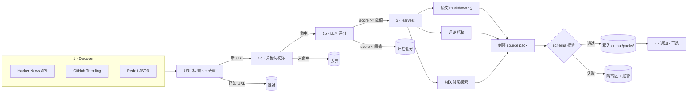

# llmx-scout-agent 规格说明书 v0.1

> 状态：草案 · 等待评审
> 范围：V0.1 MVP，覆盖三阶段流水线 + CLI + 手工注入
> 不在范围：Web UI、多 LLM provider、RSS 任意接入、复杂调度

本文是 scout 的"做什么 / 长什么样"权威文档。"为什么这么做"在 `docs/architecture-options.md`，"接口契约"在 `docs/source-pack-schema.md`。

---

## 1. 流水线与数据流

### 1.1 总图



**关键路径是文件。** 通知关掉、Discover 某个源挂掉、LLM 调用失败——只要还有 pack 写到磁盘，scout 就算完成了部分价值。

### 1.2 阶段责任边界

| 阶段 | 输入 | 输出 | 失败兜底 |
|------|------|------|---------|
| Discover | 各平台 API | 候选列表（含 URL/标题/原始 metrics） | 单源失败不阻塞，记入 source_health 表 |
| Filter & Score | 候选列表 | 高分候选 + scout_analysis 草稿 | LLM 失败：重试 2 次 → 标记降级，仅靠关键词分（可选不打包） |
| Harvest & Pack | 高分候选 | source pack 文件 | 原文抓取失败：仍可打包评论部分，warnings 写明 |
| Notify | 当日 pack 列表 | 通知消息 | 任何通知失败仅记日志，不影响其他通道 |

---

## 2. 关键数据模型

> 这里只列内部模型。对外契约见 `source-pack-schema.md`。

### 2.1 `Candidate`（流水线内传递）

```python
class Candidate:
    # 标识
    source_platform: Literal["hacker_news", "github", "reddit"]
    external_id: str             # 平台原生 ID（HN item id / GH owner-repo / Reddit post id）
    primary_url: str             # 标准化后的讨论入口 URL
    original_url: str            # 原文 URL（可能与 primary 相同）
    url_hash: str                # 标准化后 URL 的 sha256，用于去重

    # 表层信息
    title: str
    snippet: str | None          # 摘要 / 第一段，给关键词和 LLM 评分用
    author: str | None
    published_at: datetime | None
    language: str                # ISO 639-1，默认 en

    # 热度
    metrics: dict[str, int | None]   # 平台相关，原样塞 source.metrics

    # Filter 阶段填
    matched_keywords: list[str] = []
    keyword_groups: list[str] = []
    keyword_score: int = 0       # 命中权重，便于 sort

    # Score 阶段填
    llm_score: float | None = None
    llm_reasoning: str | None = None
    judgment_seed: str | None = None
    suggested_layer: str | None = None
    controversy_signals: list[ControversySignal] = []
```

### 2.2 `ControversySignal`

直接对应 schema 里 `scout_analysis.controversy_signals[]`：

```python
class ControversySignal:
    type: Literal[
        "controversy",
        "counterintuitive_data",
        "underdog_story",
        "practical_contradiction",
        "expert_disagreement",
        "other",
    ]
    evidence: str
    url: str | None = None
```

### 2.3 `DedupRecord`（持久化在 SQLite）

```sql
CREATE TABLE dedup (
    url_hash         TEXT PRIMARY KEY,
    canonical_url    TEXT NOT NULL,
    first_seen_at    TIMESTAMP NOT NULL,
    last_seen_at     TIMESTAMP NOT NULL,
    seen_count       INTEGER NOT NULL DEFAULT 1,
    pack_id          TEXT,                -- 最新一版 pack_id（重评再打包会更新）
    last_score       REAL,                -- 最近一次 LLM 评分
    last_metrics_json TEXT,               -- 上次见到时的 metrics 快照（JSON），用于重评判断
    decision         TEXT NOT NULL        -- 'packed' | 'low_score' | 'filtered_out' | 'failed' | 'resurge_packed'
);

CREATE TABLE source_health (
    source        TEXT PRIMARY KEY,        -- 'hacker_news' | 'github' | 'reddit:LocalLLaMA'
    last_ok_at    TIMESTAMP,
    last_fail_at  TIMESTAMP,
    fail_streak   INTEGER NOT NULL DEFAULT 0
);

CREATE TABLE score_history (
    id              INTEGER PRIMARY KEY AUTOINCREMENT,
    url_hash        TEXT NOT NULL,
    scored_at       TIMESTAMP NOT NULL,
    prompt_version  TEXT NOT NULL,         -- 见 §6
    score           REAL NOT NULL,
    payload_json    TEXT NOT NULL          -- 输入快照 + 完整 LLM 响应，给 score-tune 复用
);
```

**为什么留 `score_history`**：未来 `scout score-tune` 命令需要拿历史候选 + 历史 prompt 重跑，对比新旧 prompt 表现。

### 2.4 「话题级」相似性 — 暂不落库

文档里讨论过"长期标题相似度去重"。**V0.1 不实现**。理由：

- 同一话题不同视角恰恰是布道者最爱的素材，去重风险大于收益
- 真要做也是相似度阈值 + 标注关联，不是删除

后续若做，新增 `topic_clusters` 表，pack 之间通过 `related_packs` 字段交叉链接，而非合并。**这是一处刻意的非选择，不是遗漏。**

---

## 3. CLI 命令清单

```
scout discover [--source SRC]... [--dry-run] [--limit N]
                [--no-resurge | --resurge-only]
    跑一次完整流水线。--source 可重复指定，缺省=全部。
    --dry-run 只打印决策日志，不写 pack 不发通知。
    --no-resurge 关闭"今日热度补丁"重评（详见 §11）。
    --resurge-only 只跑重评，不发现新 URL。

scout pack URL [--platform PLATFORM] [--note TEXT] [--no-score]
    手工注入。跳过 Discover/关键词初筛，但仍跑 LLM 评分（不受阈值约束，必打包）。
    --no-score 跳过评分，scout_analysis 留空让你手填。
    --note 写到 scout_analysis.notes 字段。
    若 platform 缺省，从 URL 推断（hn/gh/reddit），推不出则 platform="other"。

scout list [--since DATE] [--platform P] [--min-score N]
    列出近期 pack。默认近 7 天。

scout show PACK_ID
    打印某个 pack 的元数据 + 正文摘要。

scout score-tune [--samples N] [--prompt-version V]
    用 score_history 里的样本重跑评分，输出新旧 prompt 对比表。
    支持 --samples 指定回归样本数。

scout doctor
    自检：API key 是否有效、SQLite 能否写入、output 目录是否存在、
    各 source 最近一次拉取是否成功。
```

### 使用示例

```bash
# 每天定时任务里跑这个
$ scout discover --limit 50

# 我刷推时看到一篇好文章
$ scout pack https://example.com/blog/rag-is-dead --note "评论区两派对立"

# 看看今天产出
$ scout list --since 2026-04-26

# 评分提示词改了，回归测一下
$ scout score-tune --samples 30 --prompt-version v0.2
```

---

## 4. 关键词配置文件格式

### 4.1 文件位置

`config/keywords.txt`（项目根目录下 `config/`）

### 4.2 语法（参考 TrendRadar，简化）

```
# 顶层注释以 # 开头

# 不分组的关键词（默认组）
AI
LLM
RAG

# 必须词（分组内任一基础词命中后，必须同时命中该词才算最终命中）
+多模态
+开源

# 过滤词（标题或 snippet 含此词，即使其他匹配也排除）
!训练营
!优惠券

# 正则
/\bagent\b/i        # 行尾的 i 是大小写不敏感修饰符（默认就是，显式可写）
/llama-?3/i

# 别名（命中显示用，给日志和未来 UI）
LangChain => LangChain 框架
/\bRAG\b/ => RAG 检索

# 分组（每组独立的 +/! 上下文）
[Agents]
agent
multi-agent
+orchestration
!course

[Models]
GPT-5
Claude
Gemini
+benchmark
```

### 4.3 实现要点

- 大小写默认不敏感
- 匹配范围：`title + snippet`（不匹配正文，正文阶段还没抓）
- 命中权重：基础词 1 分，必须词不计分（只是约束），命中越多权重越高，作为 LLM 评分前的排序
- 至少一个基础词命中 + 所有 `+` 命中 + 无 `!` 命中 → 进入 LLM 评分

---

## 5. 通知层设计

通知非关键路径，**任何一个通道都可以独立开关**。

### 5.1 配置

`config/notify.toml`

```toml
[dingtalk]
enabled = false
webhook = "..."
secret  = "..."

[email]
enabled = false
smtp_host = "..."
to = ["luub0464@gmail.com"]

[macos]
enabled = true   # 默认开本地通知（你在 Mac 上跑）
```

### 5.2 内容模版

每天最多发一条日报：

```
[scout] 2026-04-26 18:00 完成
- 发现候选 124，命中关键词 31，进入评分 31，打包 5
- 高分 pack:
  · [HN-43891234] RAG is dead, long live agents (8.5)
  · [GH-cline/cline] Cline v2 release notes (7.8)
  · ...
- 详情: output/packs/2026-04-26/
- 异常: reddit:singularity 连续 3 次 503
```

---

## 6. 评分提示词的版本化策略

### 6.1 文件结构

```
prompts/
├── scoring.md              # 当前正在用的版本（带 frontmatter 里的 version）
└── archive/
    ├── scoring.v0.1.md
    └── scoring.v0.2.md
```

### 6.2 版本号约定

- prompt 文件 frontmatter 必填 `version: vX.Y`
- 每次修改 prompt 必须 bump 版本，并把旧版本 copy 到 archive
- `score_history` 表里记录每次评分用的版本，便于对比

### 6.3 配套的回归测试

`scout score-tune` 命令读 `score_history`，按 `--samples N` 抽样，用当前 prompt 重跑：
- 输出表：`url | title | old_score | new_score | delta`
- 如果差异 > 1.5 分的样本超过 20%，提醒人工 review

### 6.4 校准来源

初版 prompt 用合成 few-shot；上线后用真实历史样本（用户提供 + score_history 累积）持续校准。

---

## 7. 阈值与默认值

| 项 | 默认值 | 备注 |
|---|---|---|
| LLM 评分阈值（打包） | 7.0 | 可配置；< 阈值仅写 score_history 不写 pack |
| 关键词命中后送 LLM 的最大候选数 | 50 / 次 | 控制 token 成本 |
| 单 pack 抓评论数 | 5（HN/Reddit） | top by score |
| 单 pack 正文最大字数（超出转外部文件） | 50,000 字符 | 对应 schema "建议 < 200KB" |
| 抓取超时 | 20s | 单请求 |
| 抓取失败重试 | 2 次 | 指数退避 |
| 单 source 连续失败告警阈值 | 3 | 告警≠阻塞 |

---

## 8. 错误处理 & 可观测性

### 8.1 日志

- 结构化（JSON Lines）写到 `logs/scout.YYYY-MM-DD.log`
- 关键事件：discover_start/end、score_decision、harvest_outcome、pack_written、notify_sent

### 8.2 隔离区

`output/quarantine/` 存 schema 校验失败的"半成品"，不污染 packs 目录。配合日志可手工 fix 后重新校验。

### 8.3 可见性命令

- `scout doctor`（见 §3）
- `scout list --since today`
- 直接 `tail logs/scout.*.log`

---

## 9. 已落定的关键决策（2026-04-26）

> 4 个开放问题已拍板。完整推理在 `CLAUDE.md` 决策日志，下面是要点。

| # | 决策 | 影响落地点 |
|---|---|---|
| Q1 | 评分采用三维加权（judgment_space / controversy / info_density），judgment_space < 3 时降权而不是直接 0 分 | `prompts/scoring.md` v0.1 已按此实现 |
| Q2 | `scout pack <url>` 也跑 LLM 评分，但**不受阈值约束**，必打包；提供 `--no-score` 让用户跳过 | §3 CLI 已更新；评分结果写入 scout_analysis 作为草稿 |
| Q3 | GitHub 仓库**公开**，MIT 协议 | README / LICENSE 已按公开起草 |
| Q4 | V0.1 **做**今日热度补丁（重评机制） | 见下方 §11 |

---

## 10. 不在 V0.1 范围（也不在路线图前列）

- Web UI / pack 浏览器
- 多 LLM provider
- 翻译模块
- MCP 服务
- 自动发布到下游 advocate-agent（保持文件解耦，advocate 自己 watch 文件夹即可）
- 任意 RSS 接入

如果未来要做，新增 `docs/decisions/000X-xxx.md` 记录。

---

## 11. 今日热度补丁（重评机制）

### 11.1 问题

举例：昨天 HN 一篇帖子评分 6.8（< 阈值 7.0）没打包，今天冲到 600 分、评论翻倍。这种"冷启动后爆"的内容是布道者最不想错过的——但简单的 URL 去重会让 scout 完全无视它。

### 11.2 触发条件

每次 `scout discover` 拉到当前热门列表后，与 `dedup` 表 join 找出"已知 URL 但当前 metrics 显著上涨"的候选。

显著上涨判定（满足任一即可）：

| 平台 | 主指标 | 触发规则 |
|---|---|---|
| HN | hn_score | 当前 ≥ 上次 × 1.5 **且** 当前 ≥ 上次 + 200 |
| HN | hn_comments | 当前 ≥ 上次 + 100 |
| Reddit | upvotes | 当前 ≥ 上次 × 1.5 **且** 当前 ≥ 上次 + 1000 |
| GitHub | today_stars | 当前 ≥ 上次 × 2 **且** 当前 ≥ 上次 + 50 |

阈值都可在 `config/scout.toml` 调整。

只考虑 `last_seen_at` 在近 **7 天**内的记录（更老的不再追，避免无限累积成本）。

### 11.3 重评流程

命中重评的候选按其历史 `decision` 分流：

| 历史 decision | 处理 |
|---|---|
| `low_score` | 关键词上次已命中过，**直接进 LLM 评分**，不再走关键词 |
| `filtered_out` | 上次关键词没命中（可能配置已变），**仍要过关键词初筛** |
| `failed` | **直接进 LLM 评分**（上次失败原因可能已消失） |
| `packed` / `resurge_packed` | **跳过**，已经打过包就不重复 |

重评后若 `final_score >= 阈值`：
- 走完整 Harvest & Pack 流程
- 写新 pack 文件，pack_id 加 `-resurge-N` 后缀（N 为重评次数）
- `decision` 改为 `resurge_packed`
- **原 pack 文件不动**（pack 不可变原则）

### 11.4 配置开关

- `scout discover` 默认开启重评
- `scout discover --no-resurge` 关闭重评（应急 / 调试用）
- `scout discover --resurge-only` 只跑重评不发现新 URL（测试 / 灾后补救用）

### 11.5 成本与边界

- **不增加额外网络请求**：重评数据来自 discover 已经拉到的当前热门列表，是免费的对比
- **可能增加 LLM 调用**：单次 `discover` 会多评 N 条历史候选；N 实际很小（一天爆冷的内容个位数）
- **不重复消耗大量上下文**：重评只跑评分，原文/评论的二次抓取只发生在过阈值后

### 11.6 风险

- 同一篇内容可能产生多个 pack（resurge-1、resurge-2）。下游 advocate 需要识别同 url_hash 的多版本——已经在 schema 的 `pack_id` 命名约定里隐含了这一点
- 用户可能觉得"老内容补打包"不如"主动忘掉"。提供 `--no-resurge` 兜底
